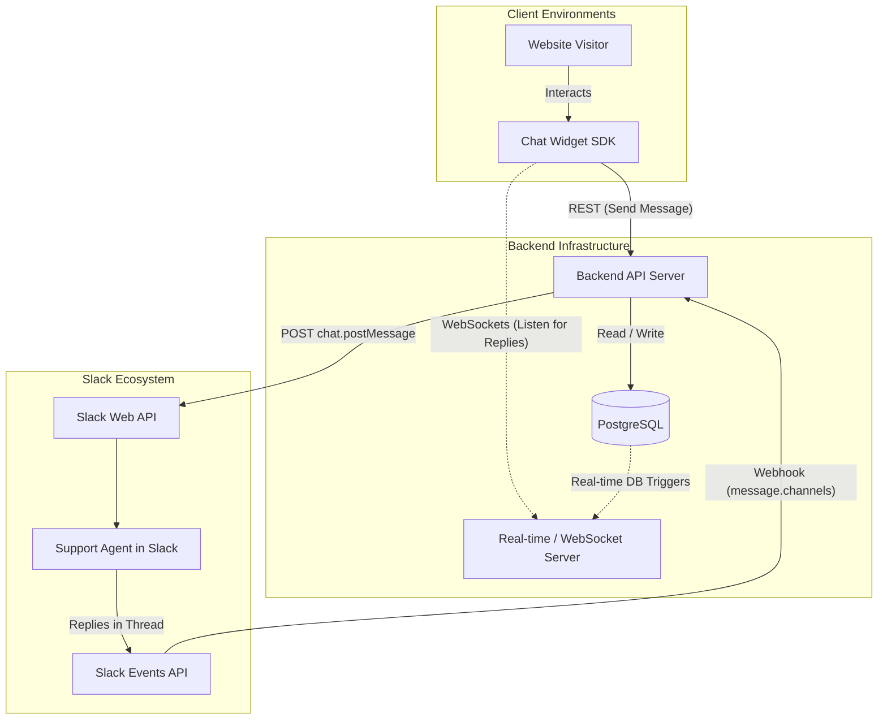
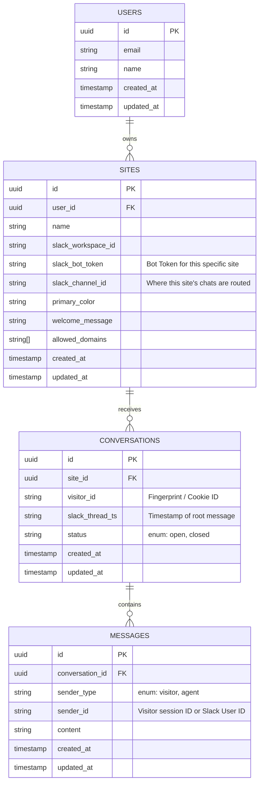

# Technical Product Requirements Document (PRD)
**Project**: Slack-Native Website Chat Platform

## 1. Product Vision & Goals
A lightweight, embeddable website chat widget that routes visitor conversations directly into Slack. It enables two-way, real-time messaging between website visitors and support teams (who remain entirely within Slack), removing the need for a separate customer support dashboard.

**Key Technical Goals:**
- **Widget Performance**: Under 100KB target load size, extremely fast initialization.
- **Real-time Sync**: Instant message delivery between the browser and Slack.
- **Simplicity**: Self-serve Slack OAuth installation flow for site owners.

---

## 2. Tech Stack

| Layer | Technology | Purpose |
|---|---|---|
| **Dashboard & API** | Next.js (App Router) | Admin dashboard UI and backend API Routes |
| **Embeddable Widget** | Vanilla JS / Preact | Lightweight `<script>` tag embed, keeps bundle under 100KB |
| **Database** | Supabase (PostgreSQL) | Persistent storage for sites, conversations, and messages |
| **Real-time** | Supabase Realtime | Pushes new agent messages from DB to the visitor's widget via WebSocket |
| **Authentication** | Supabase Auth | Magic link / email login for dashboard users |
| **Slack Integration** | Slack Web API + Events API | Sends visitor messages to Slack, receives agent replies via webhook |
| **Hosting** | Vercel | Deploys the Next.js app; `public/widget.js` is served via Vercel's Edge CDN |
| **Styling** | Tailwind CSS | Dashboard UI styling |

---

## 3. Technical Architecture

The system consists of three main components:
1. **Embeddable Widget (Frontend)**: A lightweight Javascript/React component injected via a `<script>` tag.
2. **Backend Application**: The core API server handling widget requests, database interactions, and Slack webhooks.
3. **Slack Platform Integrations**: Slack OAuth for installation, Web API for sending messages, and Events API for receiving agent replies.

### System Architecture Diagram

---

## 4. Database Schema (Simplified Per-User Model)

We are using a streamlined schema: 1 User -> N Sites. Each Site acts as the container for the widget configuration, Slack Bot token, and chat routing.

### Entity Relationship Diagram

### Table Definitions
*   **`users`**: Individual dashboard users (e.g., Indie Hackers, Founders).
*   **`sites`**: A combined entity representing the website, its widget settings, and its Slack integration. If a user has two websites, they will create two `sites` records and authorize the Slack bot twice (once for each site).
*   **`conversations`**: Support threads tied to a specific site. Maps a unique visitor to a specific `thread_ts` in a Slack channel.
*   **`messages`**: Individual chat messages. Differentiated by `sender_type`.

---

## 5. API & Integration Endpoints

### 4.1 Client-Facing API (Widget)
*   `GET /api/widget/config?site_id={id}`: Fetch widget settings.
*   `POST /api/widget/conversations`: Initialize a new conversation.
*   `POST /api/widget/messages`: Send a new message from the visitor.

### 4.2 Slack Integration
*   `GET /api/slack/install`: Initiates Slack OAuth flow.
*   `GET /api/slack/oauth_redirect`: Exchanges code for access token and saves it to the `sites` table.
*   `POST /slack/events`: The webhook endpoint Slack hits when an event occurs. 

---

## 6. Security & Privacy

1.  **Slack Signature Verification**: Verify the `X-Slack-Signature` on all requests to `/slack/events`.
2.  **CORS & Allowed Domains**: Enforce CORS rules based on the `allowed_domains` specified in `sites`.
3.  **Token Storage**: Slack bot tokens (`xoxb-`) must be securely encrypted at rest within the database.

---

## 7. Finalized Decisions

1. **Slack Channels**: Both Public and Private channels will be supported in the MVP. We will request `groups:history` alongside `channels:history`.
2. **File Uploads**: Out of scope for the MVP. Text messaging only.
